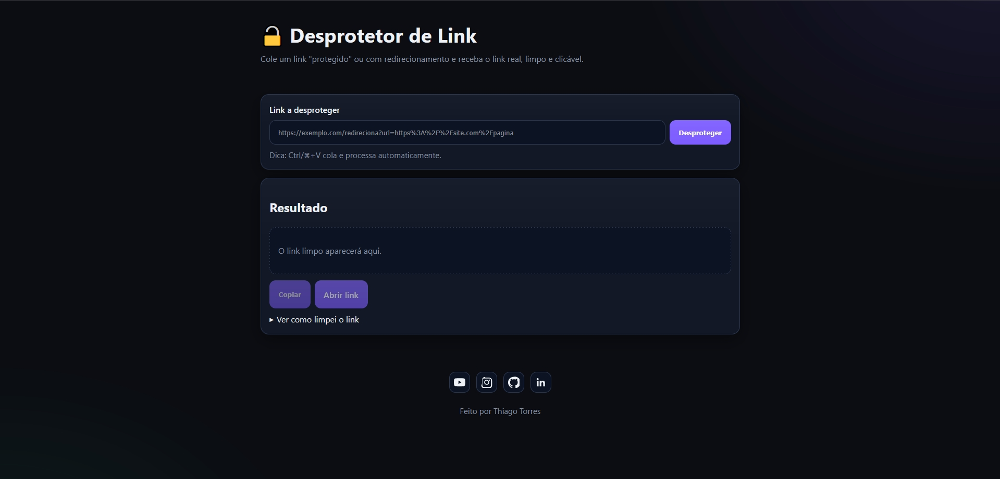

# Desprotetor de Link

[Desprotetor de Link - Click here](https://thiagotorresferrao.github.io/desprotetor-link/)

Uma ferramenta client-side para extrair o link real de URLs "protegidas" ou redirecionadas, limpando parâmetros de rastreamento.

> Observação: navegadores impõem restrições de CORS, então o app **não segue redirects por rede**. Em vez disso, ele extrai o destino real a partir de parâmetros comuns (`url`, `u`, `q`, `redirect`, etc.), decodifica camadas de URL/Base64 e remove rastreadores (`utm_*`, `fbclid`, etc.).

## Como usar
1. Abra `index.html` no navegador.
2. Cole um link com redirecionamento (ex.: `https://dominio.com/forward?url=https%3A%2F%2Fsite.com%2Fpost`).
3. Clique em **Desproteger**. O resultado aparecerá limpo e clicável.

## Redes sociais
Edite o arquivo `assets/js/config.js` com seus links de YouTube, Instagram, GitHub e LinkedIn.

## Estrutura
```
/assets
  /css/styles.css
  /img/favicon.svg
  /js/app.js
  /js/config.js
index.html
```

## Boas práticas adotadas
- HTML semântico, acessibilidade básica (`aria-live`), `label` associado ao input.
- CSS separado, responsivo e com variáveis para tema.
- JS modularizado e comentado, sem dependências externas.
- Prevenção de _tracking params_ e múltiplas camadas de encode.
- Botões de copiar e abrir com feedback visual.
- Log de transformações para transparência.
- Ícones SVG inline (sem fontes externas).
- Nenhum backend necessário.

👨‍💻 Autor | Author

Feito por Thiago Sousa
LinkedIn • Portfólio
📄 Licença | License

Este projeto é de uso livre para fins educacionais.
This project is open for educational and non-commercial use.

## 🌐 Conecte-se comigo

<div align="center">
  <a href="https://www.linkedin.com/in/thiago-f-torres/" target="_blank">
    
  </a>
  <a href="https://github.com/ThiagoTorresFerrao" target="_blank">
    
  </a>
  <a href="https://www.instagram.com/thiagotorresferrao/" target="_blank">
    
  </a>
  <a href="https://www.youtube.com/@Thiago_Torres" target="_blank">
    
  </a>
</div>